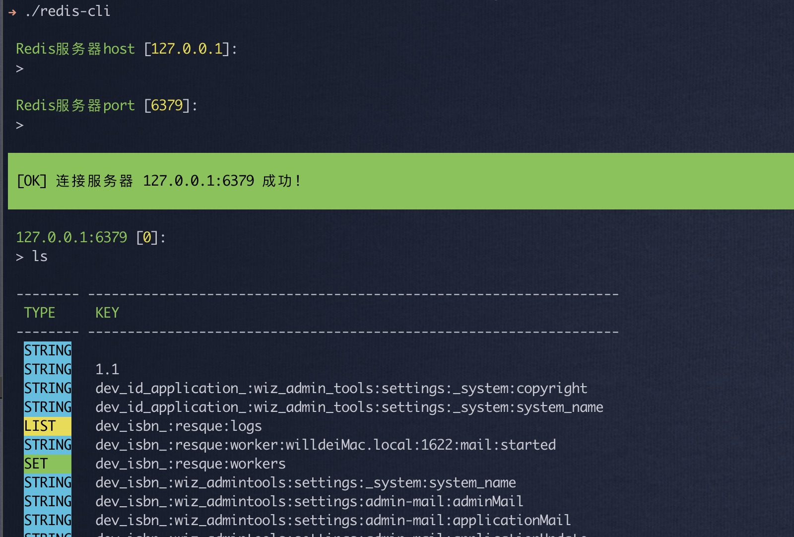

# PHP 写的简单 Redis 客户端

## 是什么

 - 简单操作redis的命令行工具
 - 简单不用每次查文档
 - 查看更直观,之前打算用Electron开发桌面版,但不熟. 所以还是先做一个命令行版本拿来用

## 为什么
 
 - 原因1: 每次做点简单的Redis操作都要翻手册,嫌麻烦. 所以把基本功能做了下简化
 - 原因2: Medis客户端收费了,同事想用发现找个简单操作的没有. 吹牛说自己写一个,于是填坑. 

## 安装方法
  1. clone项目代码:  git clone https://github.com/wizarot/redis-cli.git
  2. 进入文件件:  cd redis-cli
  3. 切换到当前最新版本tag:  git checkout v1.2
  4. 使用composer安装依赖包: composer update

## 使用方法
 - 启动: ./redis-cli
 - windows启动: redis-cli.bat (可能需要自行编辑一下,手动修改php.exe文件的路径)
 - 输入redis连接: host port (可以启用auth输入密码,如果有需要自己去src/RedisCommand.php -> connRedis() 修改 )
 - help 或者 随意输入别的,显示帮助列表
 - exit 或者 ctrl+D 退出
 - 需要php安装redis扩展. 如果实在没有那考虑自己引入pRedis bundle然后改一下 connRedis()函数就能用了,不会提issue.我抽空处理
 
 ## 特性 (如果有需求或者其他想法可以提issue)
 - (v1.2新特性)输入模仿Linux可以记录命令历史和自动帮助,上下箭头查看历史记录. (小功能但是方便了很多!)
 - 用ls列出当前数据key和对应数据类型
 - select 切换数据库,默认在 0 库
 - ls ?/* 支持通配符搜索key
 - ttl key 查看生存时间
 - ttl key second 设定生存时间
 - persist key 设定生存时间为永久
 - mv name new_name 将key改名
 - rm key 删除key
 - config 获取redis 配置信息
 - get key 获取值和对应信息(主要功能)
 - set key 设置值/新增也可以. 操作流程有待优化,但是已经可用
 
 ## 其他
 
 啰嗦下,这东西毕竟是花了些心思弄出来的.如果大家有什么想法和bug可以提issue. 我会抽时间处理.
 使用上有什么问题也可以随时问.
 
 ## TODO

  - [x] 用scan代替get * 防止出现查死数据库的情况
  - [x] 完善自动填写功能,如果没有考虑自己加一个
  - [x] 完善上下箭头访问命令历史功能
  - [ ] 完善windows命令行可执行文件使用 
